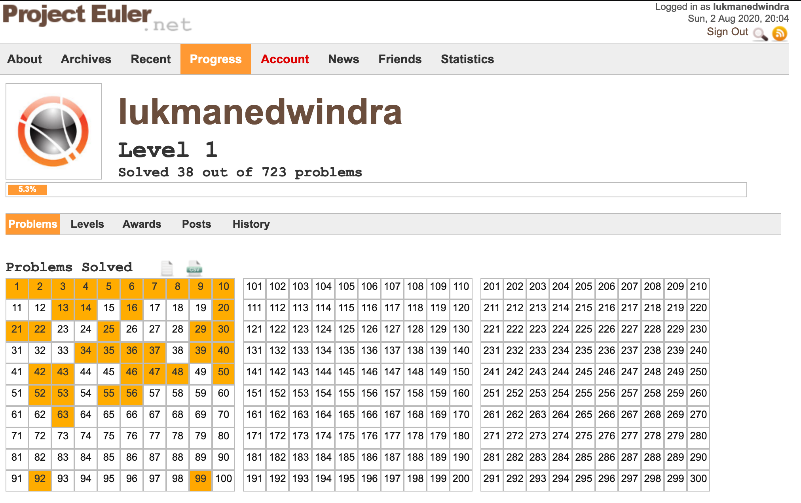

# About
Hello world :earth_asia:! Are you into mathematics and computer programming? Then [<strong>`Project Euler`</strong>](https://projecteuler.net/about) is a good platform for you. They say the users are allowed to share and discuss the first 100 problems outside of their platform. So here I am. :sunglasses:

As of August 2, 2020, I have solved 38 problems and I'm still enjoying it. :beers:



# Virtual environment and requirements
In some case, we need an external modules to solve the problems. To avoid messing up with your existing modules intalled in your machine, I would recommend using virtual environment before installing the requirements. Just do the following:

```bash
python3 -m venv .venv # install virtual environment
source .venv/bin/activate # activate virtual environment
pip install --upgrade pip # upgrade pip to its latest version
pip install -r requirements.txt # install external modules
```

Just enter <strong>`deactivate`</strong> when you want to exit from the virtual environment. If otherwise you don't want to, just go ahead installing the requirements.

# Run
As of now, I rely on [<strong>`Python (3.x)`</strong>](https://www.python.org/downloads/) to solve the problems. The <strong>`project_euler.py`</strong> file can be used as a module, which consists of the problems and answers. Below is the example when you do this on the console:

```python
>>> from project_euler import Problems
>>> project_euler = Problems() # assign object
>>> project_euler.problem_one(1000) # solve problem one
233168
>>> project_euler.problem_two() # solve problem two
4613732
```

If instead you want to run the unit test, you can just run the <strong>`test_project_euler.py`</strong> file as follows:

```bash
python test_project_euler.py
```

If passed, it will show the following result:

```
..
----------------------------------------------------------------------
Ran 2 tests in 0.001s

OK
```

Enjoy! :sunglasses: :beers:
